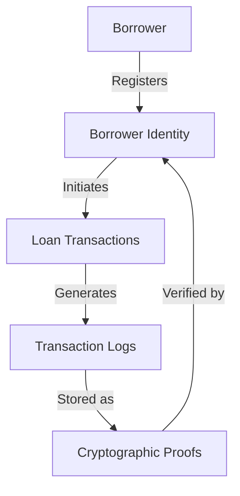

# Discrete Borrowing Computer

A blockchain-based decentralized lending platform using the Stacks blockchain, providing secure, transparent, and privacy-preserving financial transactions.

## Overview

The Discrete Borrowing Computer creates an immutable, verifiable record of financial lending activities by storing cryptographic proofs on the Stacks blockchain. It addresses critical needs in decentralized finance:

- Secure loan transaction tracking
- Tamper-proof financial records
- Cryptographic verification of lending events
- Privacy-preserving transaction logging

Key features:
- Borrower registration
- Loan transaction management
- Secure activity logging with cryptographic attestations
- Verification capabilities for financial interactions

## Architecture

The system consists of a single smart contract managing borrower registration and loan transactions. The architecture follows a modular, secure design where:

1. Borrowers are registered with unique identifiers
2. Loan transactions are tracked with cryptographic proofs
3. Financial activities are recorded as immutable attestations



## Contract Documentation

### discrete-borrowing-computer

The main contract handling decentralized lending functionality.

#### Data Storage
- `borrower-registry`: Maps borrower principals to identity information
- `loan-transactions`: Stores registered loan details
- `transaction-proofs`: Contains cryptographic proofs of financial activities
- `borrower-loan-registry`: Tracks all loans registered to each borrower

#### Access Control
- Only registered borrowers can initiate loan transactions
- Each loan can be registered once per borrower
- Transaction logs are immutable once recorded

## Getting Started

### Prerequisites
- Clarinet
- Stacks wallet
- Unique borrower identifier

### Installation

1. Clone the repository
2. Install dependencies with Clarinet
```bash
clarinet integrate
```

### Basic Usage

1. Register as a borrower:
```clarity
(contract-call? .discrete-borrowing-computer register-borrower "borrower-unique-id")
```

2. Register a loan transaction:
```clarity
(contract-call? .discrete-borrowing-computer register-loan "loan-id" u10000 u5 u12)
```

3. Log transaction proof:
```clarity
(contract-call? .discrete-borrowing-computer log-transaction-proof "loan-id" u1234567890 0x... 0x...)
```

## Function Reference

### Registration Functions

```clarity
(register-borrower (borrower-id (string-ascii 64)))
```
Registers a new borrower in the system.

```clarity
(register-loan (loan-id (string-ascii 64)) (loan-amount uint) (interest-rate uint) (loan-term-months uint))
```
Registers a new loan transaction for the borrower.

### Logging Functions

```clarity
(log-transaction-proof (loan-id (string-ascii 64)) (timestamp uint) (transaction-hash (buff 32)) (verification-proof (buff 32)))
```
Records a cryptographic proof for a loan transaction.

### Query Functions

```clarity
(get-borrower-info (borrower principal))
(get-loan-info (borrower principal) (loan-id (string-ascii 64)))
(get-borrower-loans (borrower principal))
(get-transaction-proof (borrower principal) (loan-id (string-ascii 64)) (timestamp uint))
```

### Verification Functions

```clarity
(verify-transaction-proof (borrower principal) (loan-id (string-ascii 64)) (timestamp uint) (provided-verification-proof (buff 32)))
(was-loan-active (borrower principal) (loan-id (string-ascii 64)) (timestamp uint))
```

## Development

### Testing

Run the test suite:
```bash
clarinet test
```

### Local Development
1. Start Clarinet console:
```bash
clarinet console
```

2. Deploy contract:
```bash
clarinet deploy
```

## Security Considerations

### Limitations
- Maximum 100 loans per borrower
- Transaction proofs are permanent
- Only hash-based attestations are stored on-chain

### Best Practices
- Generate strong, unique loan identifiers
- Securely store off-chain transaction details
- Regularly verify transaction proofs
- Keep borrower credentials secure
- Implement robust hash generation techniques

### Privacy
- No sensitive financial data is stored on-chain
- Only cryptographic hashes are recorded
- Financial activities can only be verified with original transaction knowledge